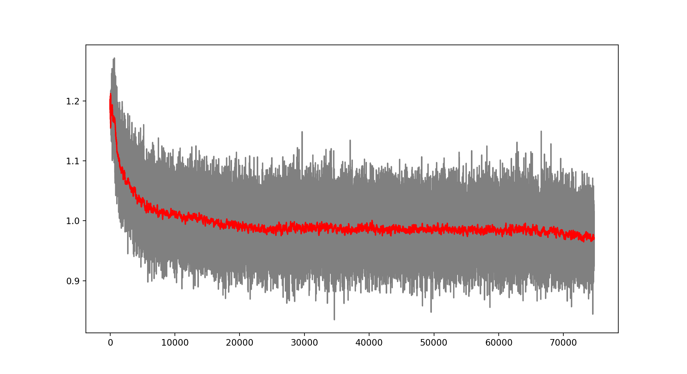

# Deep Q Learning TicTacToe

This program implements a PyGame TicTacToe that can be played by two humans, by a human vs. an algorithmic AI, and a human vs. a Neural Network trained by playing against the algorithmic AI.

While training, the visuals of the game can be disabled to make training much faster.

All the training parameters can be configured in the utilities/constants.py module.

# Neural Network Model

The basic structure of the Neural Network used takes 9 inputs (the current state of the game) and outputs 9 Q values for each of the 9 squares in the board of the game. Obviously some squares are illegal moves, hence while training there was a negative reward given to illegal moves hoping that the model learns not to play illegal moves in a given position.

At first the model was trained by playing vs. a "perfect" AI, meaning a hard coded algorithm that never looses and that will win if it is given the chance. After several thousand training rounds, I noticed that the Neural Network was not learning much; so I switched to training vs. a completely random player, so that it will also learn how to win. After training vs. the random player, the Neural Network seems to have made progress and is steadily diminishing the loss function over time.

</img>

However, the model was still generating many illegal moves so I decided to modify the reinforcement learning algorithm to punish more the illegal moves. The change consisted in populating with zeros all the corresponding illegal moves for a given position at the target values to train the network. This seemed to work very well for diminishing the illegal moves:

</img>

Nevertheless, the model was still performing quite poorly with winning only around 50% of games vs. a completely random player, where I expected to win above 90% of the time. This was after training 100,000 games, so I decided to keep training and see the results.

