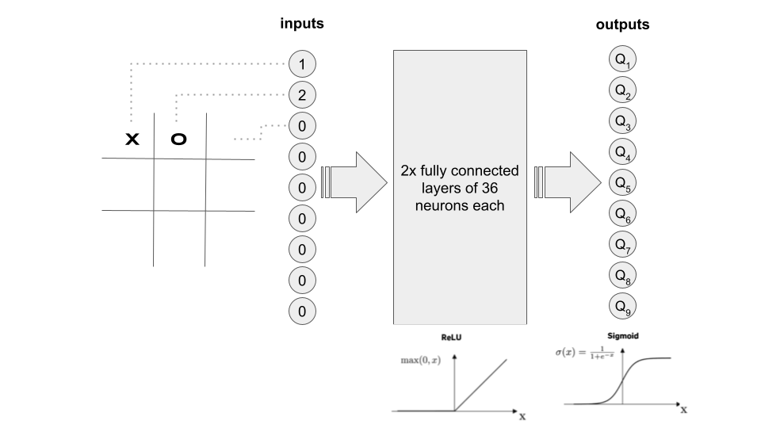

# Deep Q Learning TicTacToe

This program implements a PyGame TicTacToe that can be played by two humans, by a human vs. an algorithmic AI, and a human vs. a Neural Network trained by playing against the algorithmic AI.

While training, the visuals of the game can be disabled to make training much faster.

All the training parameters can be configured in the utilities/constants.py module.

The training algorithm uses Deep Mind's DQN recommendations:
- A replay experience memory was implemented capped at 250,000 experiences
- Batches of random experiences from the replay memory are used for every training round
- A secondary neural network was used to calculate the future Q values and then it was updated with the main network's weights every 10 games

# Neural Network Model

</img>

The Neural Network chosen takes 9 inputs (the current state of the game) and outputs 9 Q values for each of the 9 squares in the board of the game (possible actions). Obviously some squares are illegal moves, hence while training there was a negative reward given to illegal moves hoping that the model would learn not to play illegal moves in a given position.

After some trial and error I ended up with two hidden layers of 36 neurons each, all fully connected and activated via ReLu. The output layer was initially activated using sigmoid to ensure that we get a nice value between 0 and 1 that represents the QValue of a given state action pair.

At first the model was trained by playing vs. a "perfect" AI, meaning a hard coded algorithm that never looses and that will win if it is given the chance. After several thousand training rounds, I noticed that the Neural Network was not learning much; so I switched to training vs. a completely random player, so that it will also learn how to win. After training vs. the random player, the Neural Network seems to have made progress and is steadily diminishing the loss function over time.

</img>

However, the model was still generating many illegal moves, so I decided to modify the reinforcement learning algorithm to punish more the illegal moves. The change consisted in populating with zeros all the corresponding illegal moves for a given position at the target values to train the network. This seemed to work very well for diminishing the illegal moves:

</img>

Nevertheless, the model was still performing quite poorly with winning only around 50% of games vs. a completely random player, when I expected it to win above 90% of the time. You can clearly see that the loose function was stagnating for a while. This was after training 100,000 games, so I decided to keep training and see the results:

</img>

Wins: 65.46% Losses: 30.32% Ties: 4.23%

Note that when training again, the loss and illegal moves still are high in the beginning of the training round, and this is caused by the epsilon greedy strategy that prefers exploration (a completely random move) over exploitation, and this preference diminishes over time.

After this second round of 100,000 games, I can see that the loss function actually started to diminish, and the win rate ended up at 65%, so with little hope I decided to carry on and do another round of 100,000 games (about 2 hours in an i7 MacBook Pro):

After giving it some thought and not getting the results I wanted, I decided to change the output activation function to linear, since the output is supposed to be a Q value, and not a probability of action. After this change the results were:

</img>
